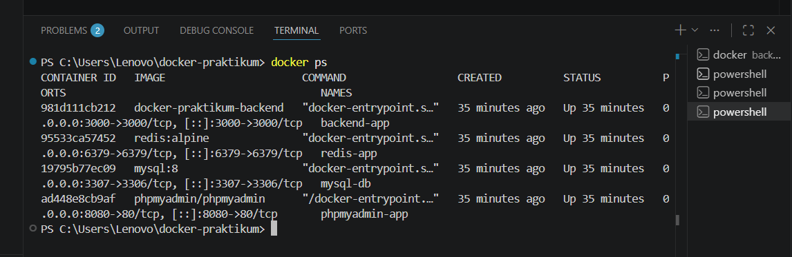
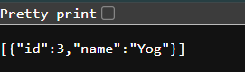
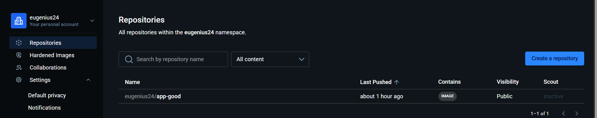

# Final Project Docker

## Deskripsi Project

Project ini merupakan aplikasi CRUD User menggunakan Node.js, MySQL, Redis, phpMyAdmin, dan Docker Compose.

Fitur aplikasi:
- Menampilkan user
- Menambahkan user
- Mengubah user
- Menghapus user
- Multi-container menggunakan Docker Compose

---

# Struktur Project

```bash
docker-praktikum/
│
├── backend/
│   ├── app.js
│   ├── Dockerfile
│   ├── Dockerfile.bad
│   ├── .dockerignore
│   ├── .env
│   └── package.json
│
├── screenshots/
│   ├── docker-ps.png
│   ├── get-users.png
│   └── dockerhub.png
│
├── docker-compose.yml
└── README.md
```

---

# Pengujian Docker Compose

Menjalankan seluruh service menggunakan Docker Compose.

Command:

```bash
docker compose up --build
```

Hasil:
- backend berjalan pada port 3000
- mysql berjalan pada port 3306
- redis berjalan pada port 6379
- phpmyadmin berjalan pada port 8080

---

# Pengujian Container

Command:

```bash
docker ps
```

Container yang aktif:
- backend-app
- mysql-db
- redis-app
- phpmyadmin-app

### Screenshot Docker PS



---

# Pengujian Volume

Command:

```bash
docker volume ls
```

Volume digunakan untuk menyimpan data MySQL agar tetap tersimpan walaupun container dimatikan.

---

# Pengujian Network

Command:

```bash
docker network ls
```

Docker Compose otomatis membuat network agar seluruh container dapat saling terhubung.

---

# Pengujian Endpoint API

## GET Users

Endpoint:

```bash
GET /users
```

URL:

```bash
http://localhost:3000/users
```

Response berhasil menampilkan data user dalam format JSON.

### Screenshot GET Users



---

## POST User

Command PowerShell:

```powershell
Invoke-RestMethod `
  -Uri "http://localhost:3000/users" `
  -Method POST `
  -ContentType "application/json" `
  -Body '{"name":"Yog"}'
```

Response berhasil menambahkan user baru ke database.

---

## PUT User

Command PowerShell:

```powershell
Invoke-RestMethod `
  -Uri "http://localhost:3000/users/1" `
  -Method PUT `
  -ContentType "application/json" `
  -Body '{"name":"Yogi"}'
```

Response berhasil mengubah data user.

---

## DELETE User

Command PowerShell:

```powershell
Invoke-RestMethod `
  -Uri "http://localhost:3000/users/1" `
  -Method DELETE
```

Response berhasil menghapus data user.

---

# Pengujian Docker Hub

Docker image berhasil di-push ke Docker Hub.

Command:

```bash
docker push eugenius24/app-good
```

Repository Docker Hub:

```bash
https://hub.docker.com/
```

### Screenshot Docker Hub



---

# Optimasi Docker Image

Pengujian dilakukan menggunakan dua Dockerfile:
- Dockerfile.bad
- Dockerfile optimized menggunakan alpine

Command build:

```bash
docker build -t app-bad -f Dockerfile.bad .
```

```bash
docker build -t app-good .
```

Hasil:
- Image optimized menggunakan alpine
- Ukuran image optimized lebih kecil
- Build lebih cepat karena cache layer
- File .env tidak ikut masuk build context

---

# Pengujian Docker Images

Command:

```bash
docker images
```

Digunakan untuk melihat daftar image Docker yang berhasil dibuat.

---

# Pengujian phpMyAdmin

phpMyAdmin berhasil dijalankan melalui browser.

URL:

```bash
http://localhost:8080
```

Digunakan untuk melihat database MySQL secara visual.

---

# Kesimpulan

Docker Compose mempermudah pengelolaan multi-container application. Penggunaan volume membuat data database tetap tersimpan, sedangkan optimasi image menggunakan alpine membantu memperkecil ukuran image Docker dan mempercepat proses build.

---

# Author

# Author

Nama: Eugenius Arlanda Wangkur  
Repository: final-project-docker-2415354072